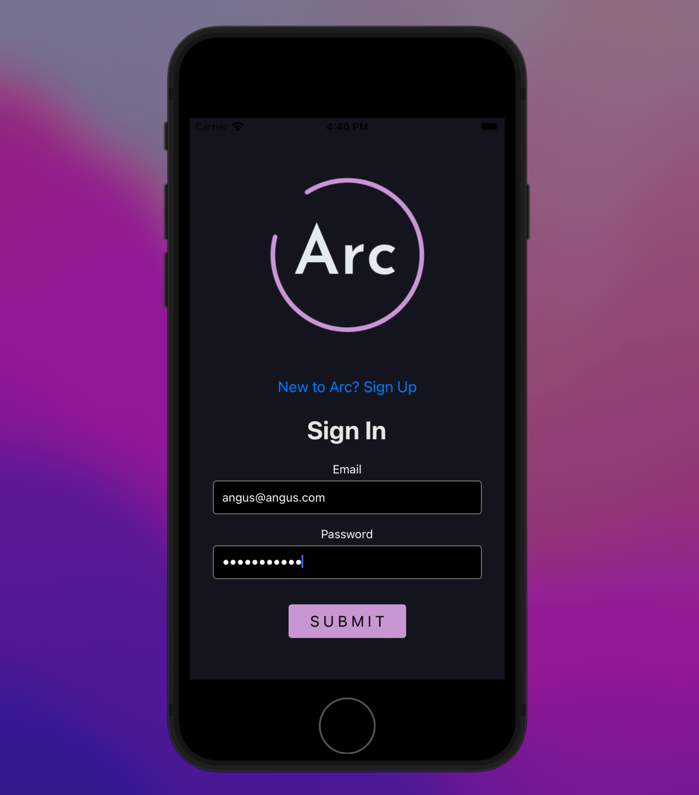
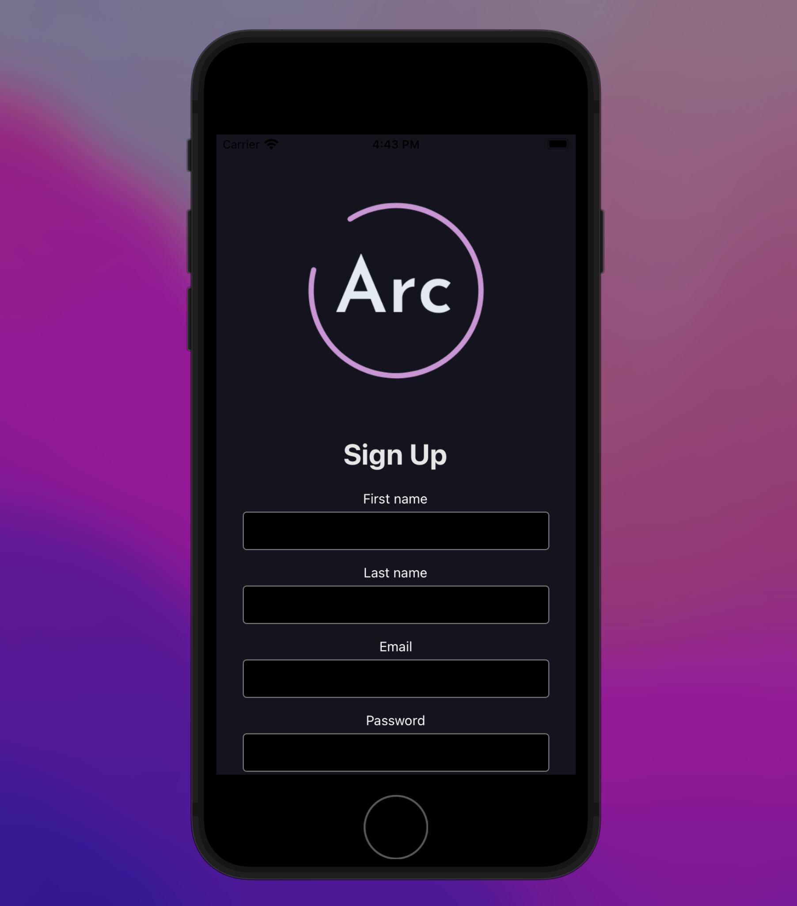
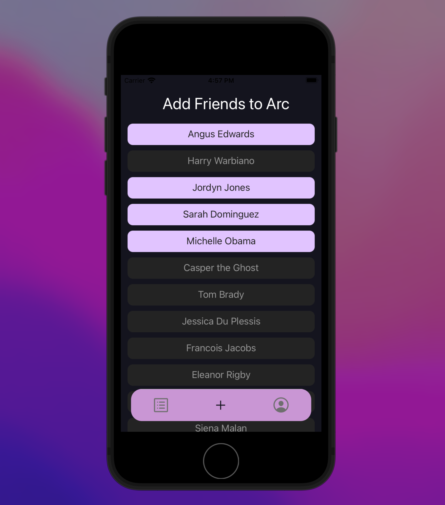
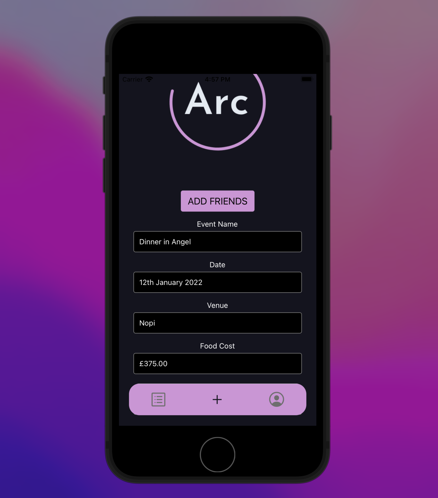
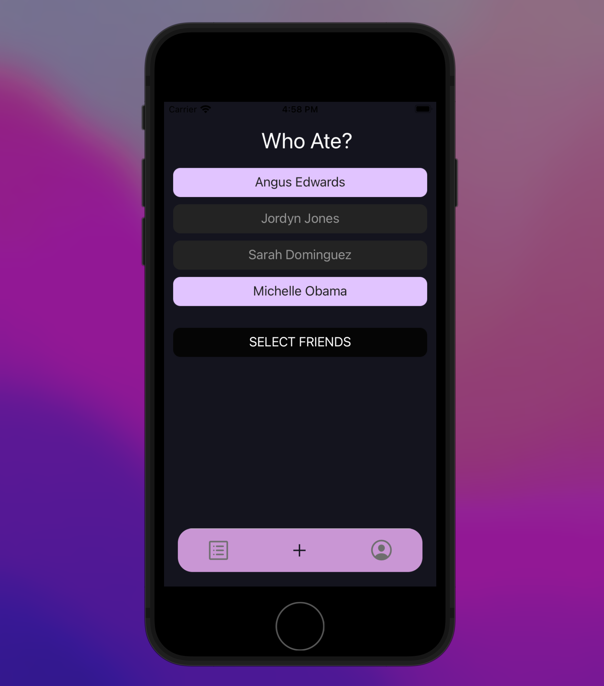
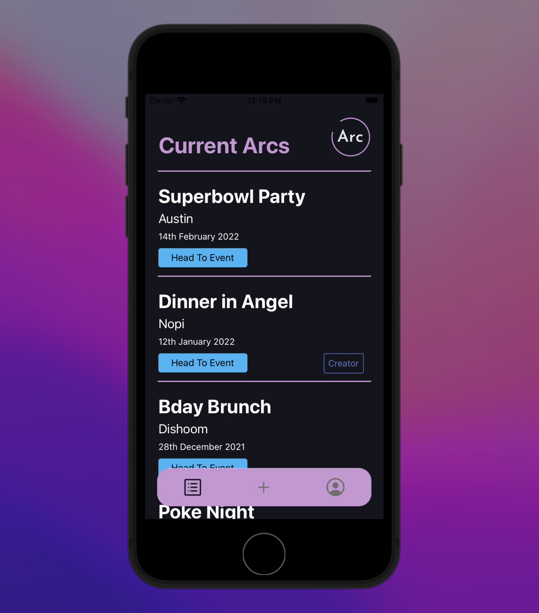
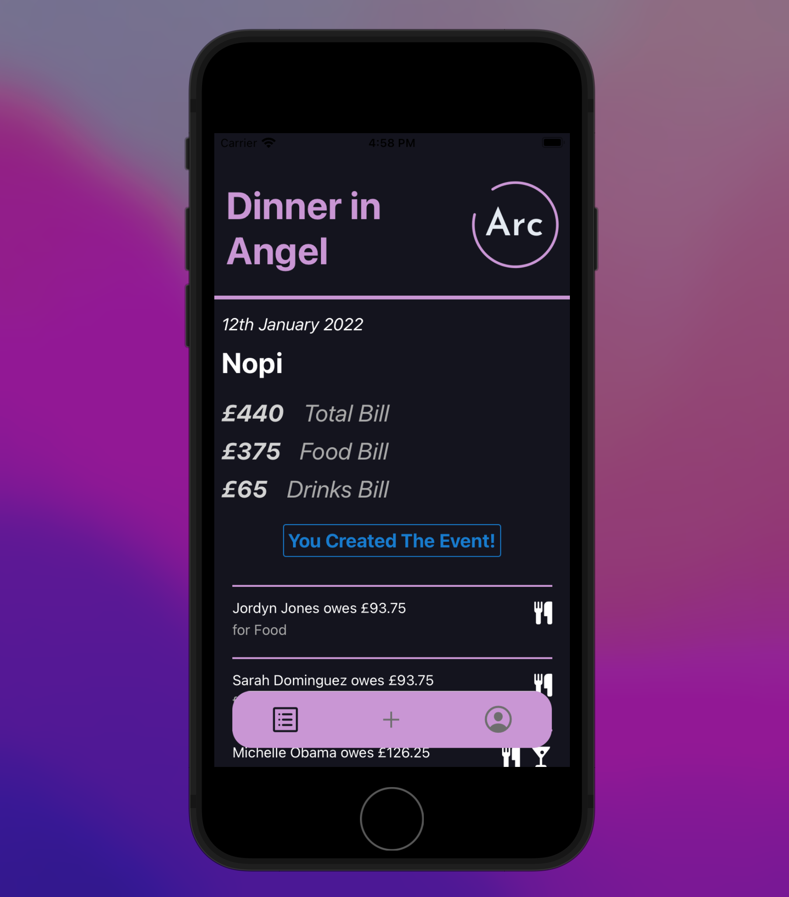
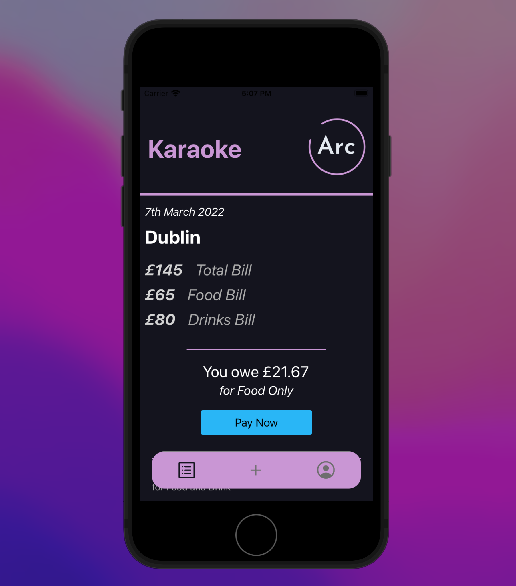
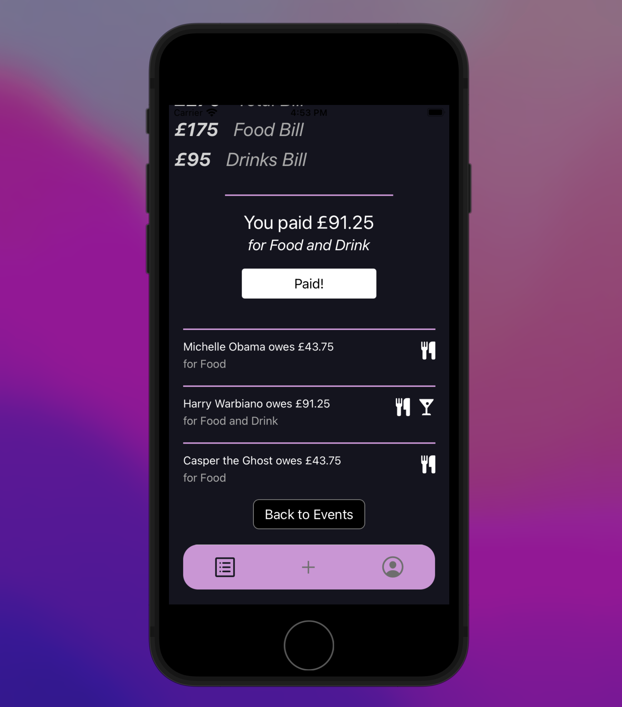

# Arc2.0

## What is Arc:
Arc is a bill allocation application, designed to make splitting tabs after an event easier!

<!--  -->

  
  

When a user signs up or logs in, they will hit their landing page, where they can edit their current information or contact details. From here they can navigate to a new arc, by clicking the 'create' button, or alternatively the plus on the tab navigator at the bottom.

  
  
  

When creating a new bill, a user will need to select the friends who attended, along with a name and date for the event. As they input the food and drink cost, they will be forced to select which attendees from the event particpiated in each, enabling the app to make the necessary breakdowns per person.

  
  

A user can head to the event page, where they will see a list of existing arcs, organised by date, showing some high level details of each event. If they were the creator, a tag will appear indicating so. They can then head to the event to unfurl a list of the full details associated with it.

  
  

Within the event page itself, the full breakdown displays detailed information, such as attendees and total costs for food and drink. Further down, the user can see exactly what they owe, and for what, with accompanying icons displaying the food and drink breakdown. If they're the host there will be no option to pay; for all other attendees, a 'pay now' button will exist. Once they have paid they can click the button, allowing the host and all other attendees to see that they have done so. Below their own summary, they can see the full list of who else attended, and who owes how much and for what. Once again, this information will update whenever an attendee has paid their own tab and confirmed that they have done so. 

## Upcoming Features:
Key components which will be implemented in the coming weeks are as follows:
* Push notifications. This is a key feature and a first priority.
* Options to split costs more specifically, designating different amounts for food or drink for individuals if the host
wishes to do so.
* The options to upload photos, so that the organiser can add a photo of the physical bill itself.
* Cross-contribution so that different users can upload bills to the event, in the case that it was a multi-day occasion
or holiday tab etc.
* In app-payments. Bigger feature to implement of course, but a key one for making the entire application self-sufficient.

## Getting Started:
To run the application you will need mongo installed on your computer and running, as well as expo. Once you have these,
head into the server folder, running '$npm i', followed by '$nodemon index.js'.
In a new terminal, head into the main folder, and in a new terminal window, run '$expo start'. It will then provide you
the option to select your desired ios or android system. If you have expo go on your phone you can also scan the QR code 
and use the app there. (If you have a mac you will need XCode in order to run the iPhone simulator).
I have moved the application over to a fresh repo entirely (with the previous application now listed as private, but
can be made public on request) due to an issue that was causing the front-end to nest within an unreachable
subfolder on github. Hence the lack of previous commits.

Tech stack:
React Native,
Node,
Typescript,
Expo,
Mongo/Mongoose,
Express.

Thanks for taking a look at Arc, and if you have any questions please do reach out!
